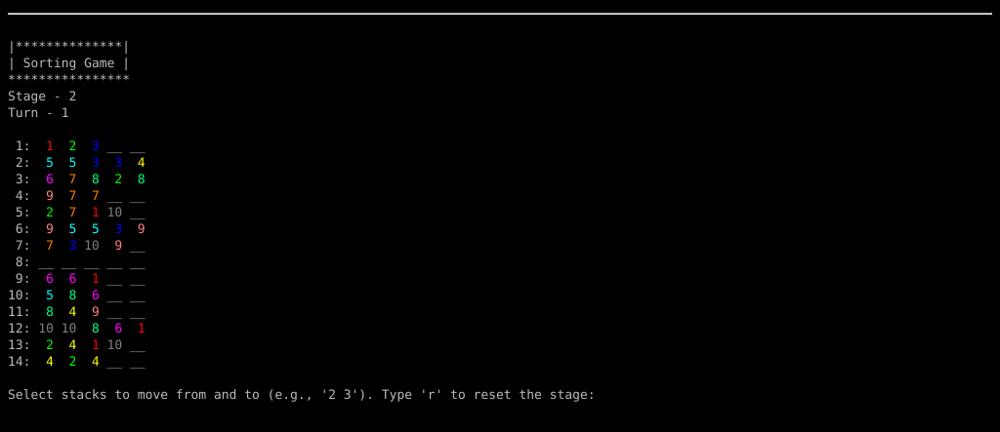

# Sorting Game

The sorting game is comprised of `stacks` of varying sizes, and of several `kinds`. Each `kind` has multiple `units`, scattered across the `stacks`.
You may move `units` of a `kind` from one `stack` to another if the top `units` in both `stacks` are of the same `kind`, and if there is room in the second `stack` for all said `units` from the first `stack`.
The goal is for all `stacks` to be either empty, or contain all `units` of a single `kind`.

